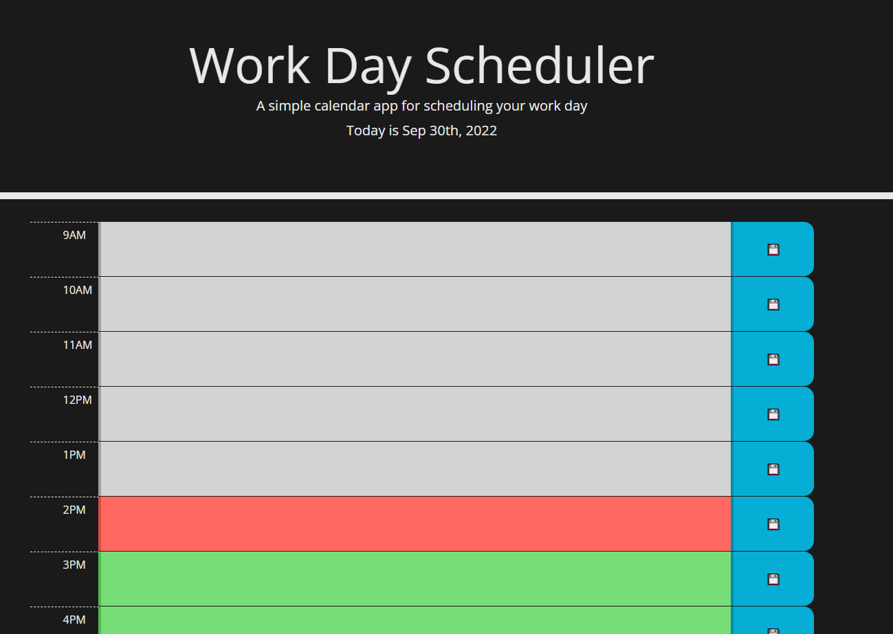
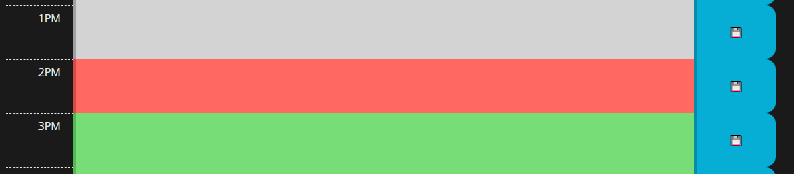
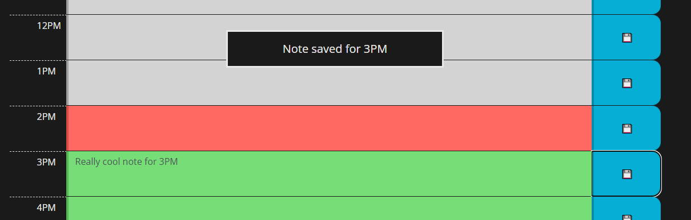

# Week 5: Project Tracker

## Description

For our fifth week in our web development course, we were tasked with creating a simple note taking web app using a library of third party API's (including jQuery and Bootstrap) to accelerate workflow, along with using moment.js to display hour relevant information to the page.

The first and most obvious step to take is successfully implementing a text entry field, which luckily couldn't be easier when you utilize Bootstrap, as they have a number of labeled text entry presets ready to go. Initially, I was planning to use a jQuery UI button widget with an icon as the "Save" button, but it proved too unwiedly to work with. The amount of work that would go into correcting all the stock styling the widget came with along with the struggles of the save disk icon being too small (and looking aliased and terrible when scaled up), a simple button built by hand worked far better.

After adjusting the CSS styling to properly align and space the text entry row using a few Bootstrap commands, it was time to generate that text entry row "n" number of times. This was achieved with two simple arrays that stores a marker and a parallel array that stores the text content of its respective field. This is where jQuery really shines. With only a few commands I was able to generate and append 12 rows to their parent container, and give each text field a unique class that tied it to its respective button. Specifically, each entry field would get a "box-for-XX" class, and the button would get "button-for-XX", where XX is an entry in the marker array.

So we now have 12 or so note entry boxes, all with its own label and a button with a unique ID. The difficult part then was how do we tie each button to its partner text box without hoards of redundant code? Well jQuery saves us again. Giving a click event to all "button" objects, we call "this.className" to make its unique "button-for-XX" known. Then we sort through the marker array and find the marker that matches the button we just clicked, and finally using that known marker we save the text content of ONLY the button's respective text box.

Finally to add timekeeping to contextualize the note entry fields, we invoke "moment()" formated as "HH" and compare it to a "time" variable that is generated when the text entry rows are being appended. A for() loop "i" incrementing happens to line up with moment()'s 24 hour time formatting, so it was simple to add an if() that either applied a "past" (gray) "present" (red) or "future" (green) CSS class to the text entry field.

## Installation

N/A Already deployed on GitHub pages. 
https://tannerkothlow.github.io/work-day-scheduler/

## Usage

Firstly, the colored boxes indicate which timeslots have passed and which are upcoming. For example, it is 2PM when this screenshot was taken. The 1PM timebox is grayed out as 1PM has already passed, 2PM is highlighted in red, as time is running out to complete whatever needs to be done in that timeslot, and the following hours are green, indicating that those timeslots are at least an hour out.

To write your note, enter your desired text into the respective time entry text field. When you want to save that text, hit the blue save button to the right of the text entry field. 

A notification will indicate that your note has been saved successfully. Your note will then be displayed in that text entry field, and will even persist through browser reloads!

NOTE: Each save button ONLY saves its respective text field and deletions will also have to be saved.

## License

Starter code provided by UofM Coding Bootcamp Instructors. 

Standard MIT license, coursework.
